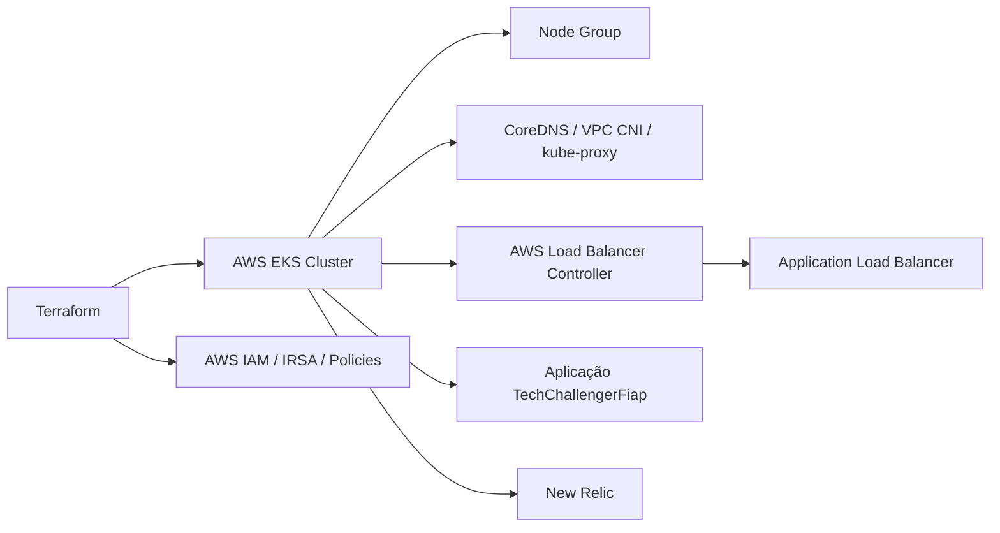

# TechChallengerFiap-K8s

## Propósito

Este repositório tem como objetivo provisionar a infraestrutura Kubernetes do projeto TechChallengerFiap na AWS. Ele define o cluster EKS, os grupos de nós, os addons do Kubernetes, a integração com o AWS Load Balancer Controller e a observabilidade via New Relic.

## Tecnologias utilizadas

- Terraform
- AWS EKS
- Kubernetes
- Helm
- AWS IAM
- OIDC / IRSA
- AWS Load Balancer Controller
- New Relic
- AWS CLI

## Arquitetura específica do repositório



A arquitetura deste repositório é voltada para infraestrutura de produção e alta disponibilidade, permitindo o cluster EKS receber a aplicação e expor os serviços via load balancer.

## Passos para execução e deploy

### Pré-requisitos

- Terraform >= 1.6
- AWS CLI autenticado
- Permissões para criar EKS, IAM, VPC, subnets e Load Balancers
- kubectl e helm instalados

### Execução do provisionamento

```bash
cd TechChallengerFiap-K8s/TFs
terraform init
terraform validate
terraform plan
terraform apply
```

### Verificação do cluster

```bash
aws eks update-kubeconfig --name <nome-do-cluster> --region us-east-2
kubectl get nodes
kubectl get pods -A
kubectl get svc -A
```

## Deploy

A criação do cluster e dos componentes de roteamento ocorre pelo Terraform:

```bash
cd TechChallengerFiap-K8s/TFs
terraform apply -auto-approve
```

Este processo cria os principais elementos da infraestrutura:

- Cluster EKS
- Node group
- Addons do Kubernetes
- Role e policy IAM
- ServiceAccount do controller
- Helm release do AWS Load Balancer Controller

## Estrutura principal

```text
TechChallengerFiap-K8s/
├── TFs/
│   ├── data.tf
│   ├── main.tf
│   ├── provider.tf
│   ├── resources.tf
│   ├── variables.tf
│   ├── terraform.tfvars
│   ├── iam/
│   │   └── aws-load-balancer-controller-policy.json
│   └── terraform.tfstate
├── README.md
└── ...
```

## Link para Swagger / Postman

Como o foco deste repositório é a infraestrutura, a documentação da aplicação fica no repositório da API principal:

- Swagger da API: http://localhost:3000/api-docs
- Postman: importar a documentação OpenAPI do Swagger da API principal ou testar os endpoints diretamente com as rotas expostas pelo ambiente em execução.

## Observações

- Valores sensíveis como `newrelic_license_key` devem permanecer fora do controle de versão.
- A configuração de rede e IAM deve ser revisada antes de qualquer deploy em ambiente compartilhado ou produção.

---

